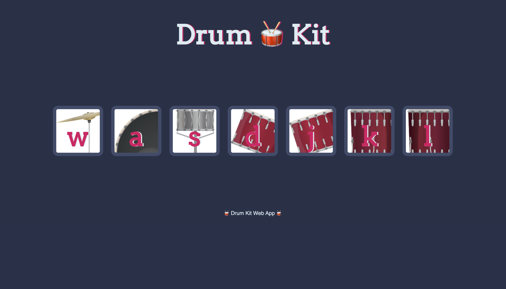

<!-- Please update value in the {}  -->

<h1 align="center">{ Drum Kit Web App } 💻 </h1>

<!-- TABLE OF CONTENTS -->

## Table of Contents

- [Overview](#overview)
  - [Built With](#built-with)
- [Contact](#contact)

<!-- OVERVIEW -->

## Overview

- What have you learned/improved?
  - Working on this project helped me get comfortable with document object model (DOM). Also javascript functions

### Built With

<!-- This section should list any major frameworks that you built your project using. Here are a few examples.-->

- [Javascript]()
- [CSS]()
- [HTML]()

## Contact

- Devolopment Portfolio [miguelcamiloportfolio.netlify.app](https://miguelcamiloportfolio.netlify.app})
- GitHub [@MiguelCamilo](https://{github.com/MiguelCamilo})

## Preview 

